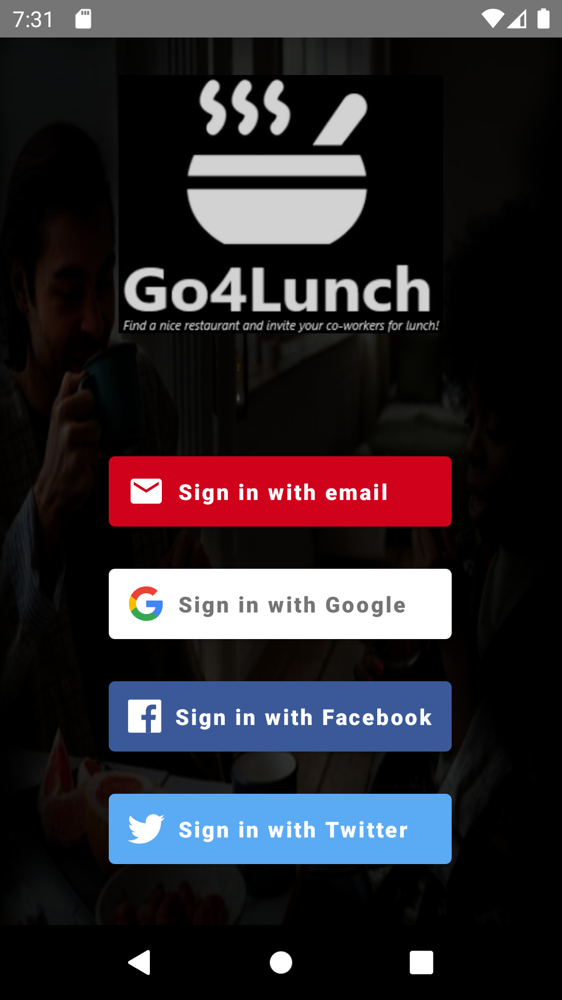
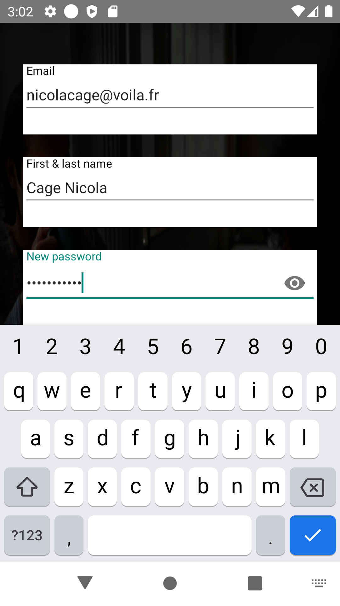
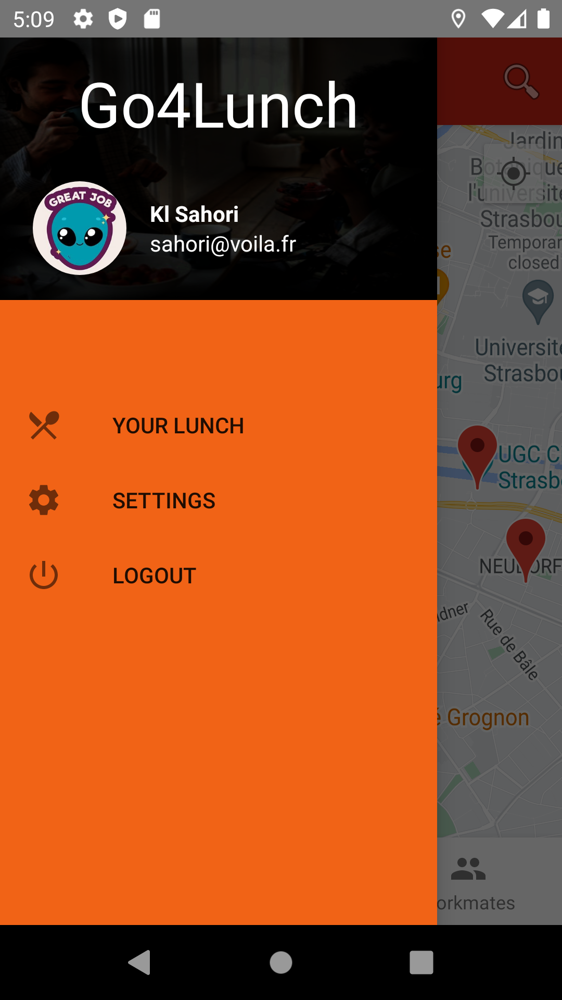
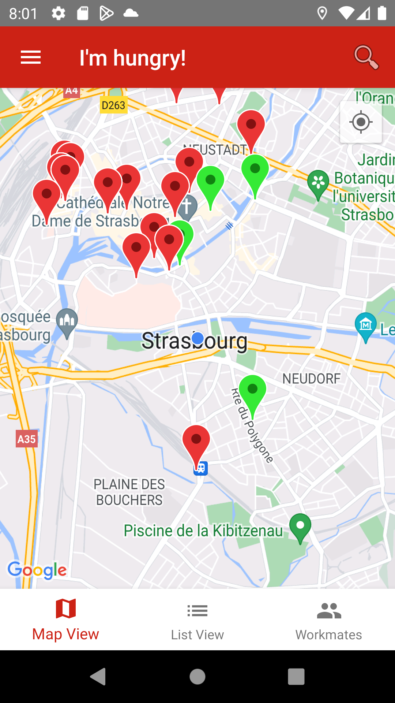
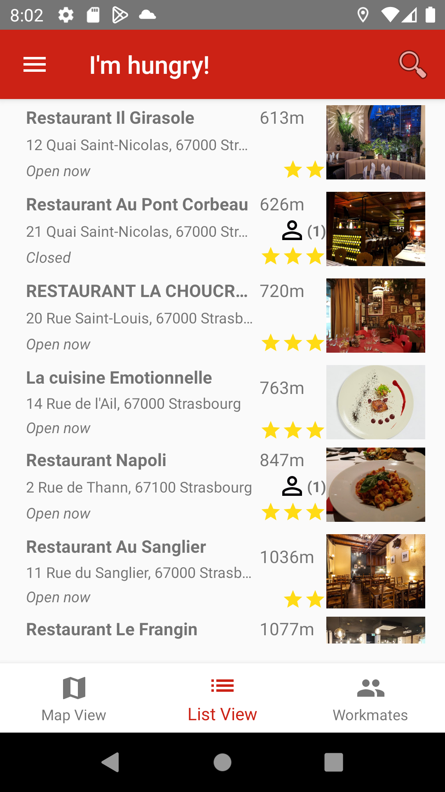
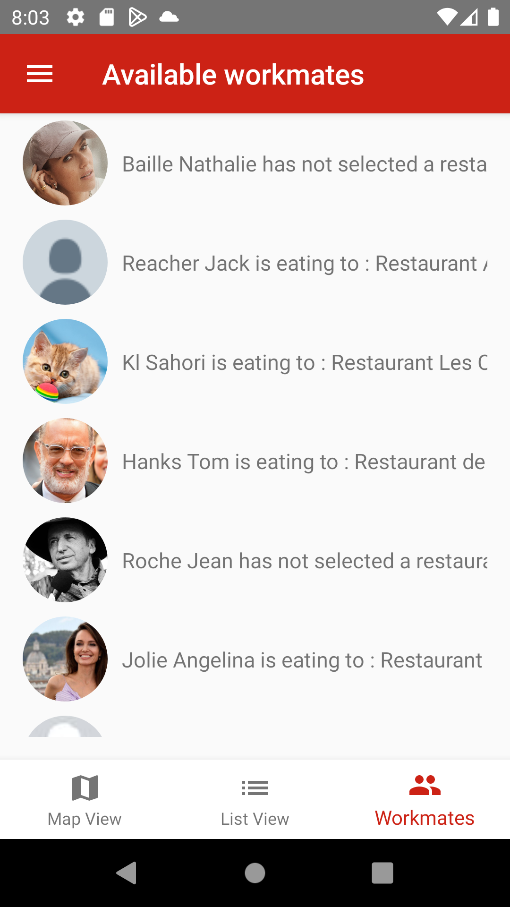
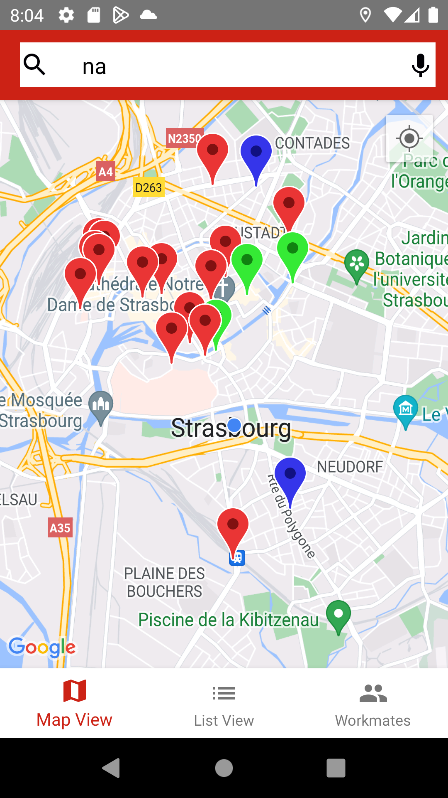
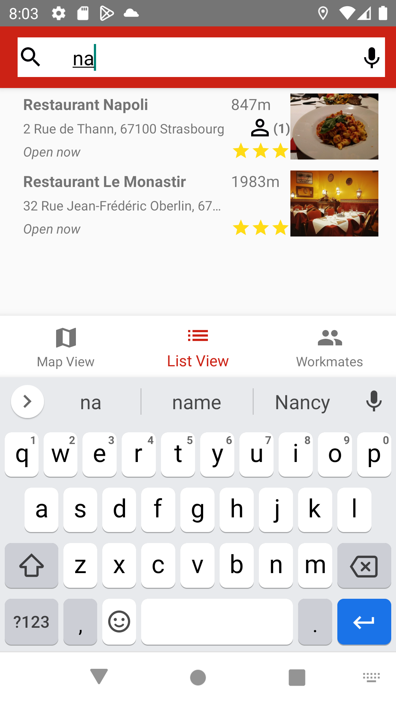
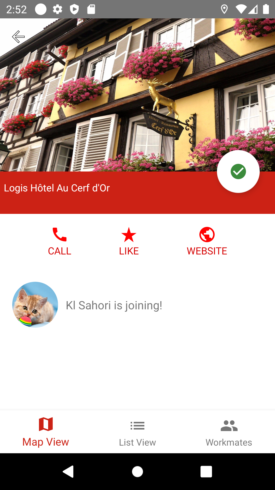
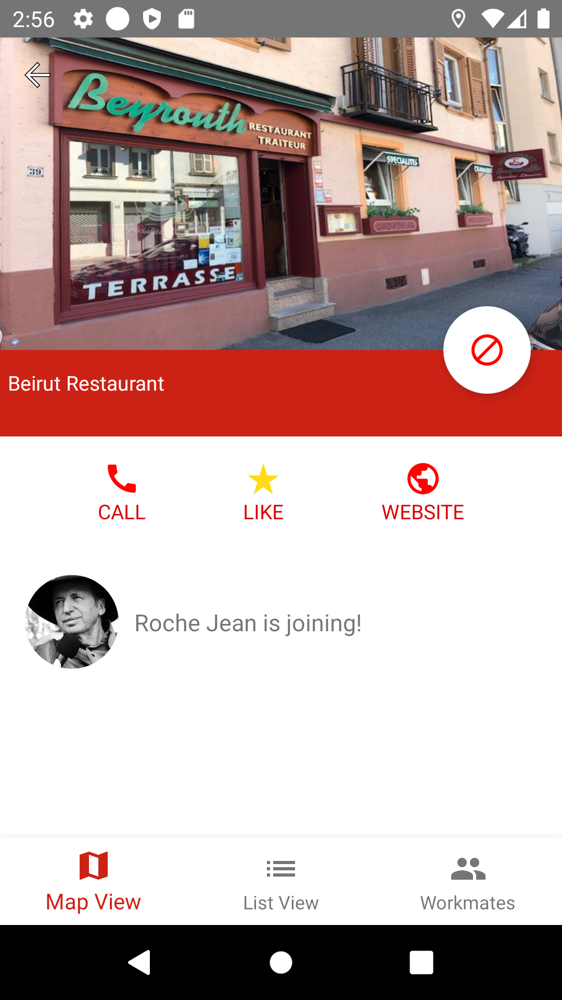

# **Projet N°7 : "Go4Lunch" OPENCLASSROOMS**
_________________________________________________________________________________________________________________

Ce dépot contient une mini-application pour le Projet 7 du parcours Grande École du Numérique pour le cursus Développeur d'Application Android

## Introduction

L'application Go4Lunch a pour principe d'être une application collaborative utilisée par tous les employés. Elle permet de rechercher un restaurant dans les environs, puis de sélectionner celui de son choix en faisant part à ses collègues. De la même manière, il est possible de consulter les restaurants sélectionnés par les collègues afin de se joindre à eux. Un peu avant l'heure du déjeuner, l'application notifie les différents employés pour les inviter à rejoindre leurs collègues.
_________________________________________________________________________________________________________________

## Login et enregistrement d'un compte




_________________________________________________________________________________________________________________

## Vues principales de l'application

 




_________________________________________________________________________________________________________________

## Recherche d'un restaurant sur la carte et la liste




_________________________________________________________________________________________________________________

## Liker ou déliker un restaurant





_________________________________________________________________________________________________________________

## Vue "firebase" avant et après l'ajout d'un nouveau utilisateur et vues des différents documents




_________________________________________________________________________________________________________________

Tests Unitaires :
- 
- 











